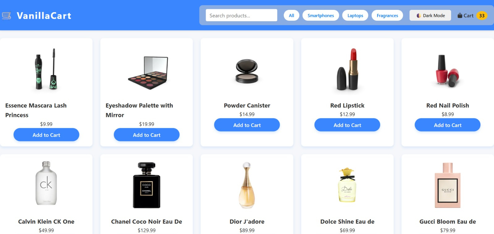
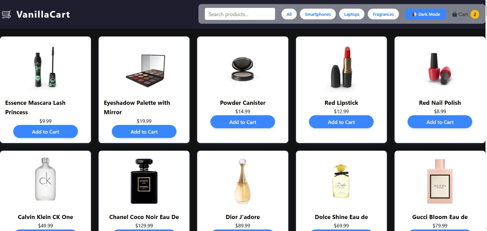
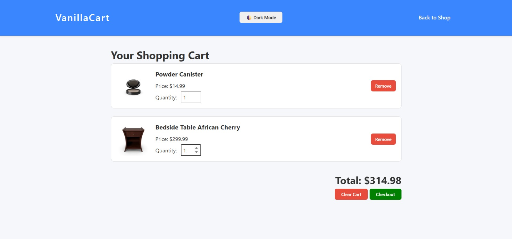

# vanillaCart
### Main Product Listing (Light Mode)

This screenshot shows the main product listing page of the "VanillaCart" project in light mode. The interface features:

A blue header with the VanillaCart logo and name.
A search bar to filter products.
Category filter buttons (All, Smartphones, Laptops, Fragrances).
A toggle for dark mode and a cart icon showing the number of items.
A grid of product cards displaying makeup and fragrance products, each with an image, name, price, and an "Add to Cart" button.

### Main Product Listing (Dark Mode)

This screenshot displays the same product grid and features as Image 1, but in dark mode. The background and header are dark, maintaining the clean, modern look while providing a night-friendly theme.

### Shopping Cart View

This screenshot shows the shopping cart page. It features:

The VanillaCart header with navigation options.
A section titled "Your Shopping Cart" listing the items added to the cart, each showing the product image, name, price, quantity selector, and a remove button.
At the bottom right, the total price of all items is displayed, with "Clear Cart" and "Checkout" buttons available for actions.
